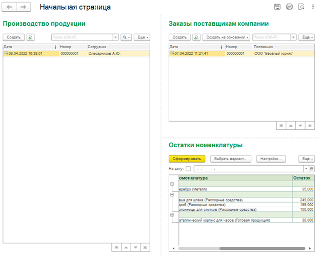

# 1С:Фактория — комплексное решение для металлургического завода

## Описание проекта

Информационная система автоматизации хозяйственной деятельности металлургического завода «1С:Фактория».
Проект реализует широкий набор функциональных блоков: от управления данными организации и номенклатуры до документооборота, учёта остатков, производства и финансовой отчётности.

### Основные параметры

* Тип проекта: учебно-портфолио / корпоративное решение
* Платформа: 1С:Предприятие 8.3 (управляемые формы)
* Конфигурация: пустая (разработка с нуля)

## Структура решения и ключевые задачи

### 1. Данные организации и номенклатура

* Хранение информации о генеральном директоре (ФИО), ИНН и юридическом наименовании организации.
* Единая форма редактирования этих данных.
* Иерархический справочник «Номенклатура» с полями:

  * Артикул
  * Наименование
  * Номенклатурная группа (родительская категория)

### 2. Контрагенты и договоры

* Справочник «Контрагенты» (поставщики и клиенты).
* Справочник «Договоры» с привязкой к контрагентам.

### 3. Учёт сотрудников

* Справочник «Сотрудники» с отдельными реквизитами: Фамилия, Имя, Отчество, Дата рождения.
* В карточке организации выбор генерального директора из списка сотрудников.

### 4. Классификация номенклатуры

* Тип номенклатуры:

  * Материал
  * Расходный материал
  * Услуга
  * Товар
* Происхождение номенклатуры: Импортный / Отечественный

### 5. Образование сотрудников

* Вкладка «Образование» в карточке сотрудника: специализация и период обучения.

### 6. Заказы поставщику

* Документ «Заказ поставщику» с табличными частями:

  * Материалы (фильтр по типу «Материал»)
  * Расходные материалы (фильтр по типу «Расходный материал»)
* Реквизиты: номер/дата, поставщик, договор.

### 7. Алгоритмы расчёта в заказе поставщику

* Автоматический расчёт суммы поля в табличных частях (цена × количество).
* Итоговые итоги по колонкам «Сумма».
* Блокировка ручного редактирования суммы.
* Отображение группы номенклатуры в представлении элементов.

### 8. Приходно-расходные документы и производство

* Документы:

  * Приходная накладная (на основании заказа поставщику)
  * Расходная накладная
  * Производство продукции
* Табличные части: учёт материалов, товаров, услуг, скидок.
* Двойное движение регистра накопления для производства.

### 9. Отчёты и аналитика

* Отчёт по продажам (СКД, круговая диаграмма, сводная таблица).
* Отчёт по остаткам номенклатуры (регистр накопления).
* Оборотно-сальдовая ведомость (финансовые проводки ПКО/Счёт на оплату).
* Отчёт по заработной плате (ставка × отработанные часы).

### 10. Интерфейс и безопасность

* Единая начальная страница с быстрыми ссылками на ключевые блоки.
* Реализация аутентификации пользователей.
* Проверки заполнения обязательных данных (организация, реквизиты).

## Структура репозитория

```
/1С-Projects/
  /Фактория/
    /Скриншоты/           — интерфейсные формы и отчёты
    README.md             — описание решения
    Фактория.dt           — выгрузка конфигурации
```

## Скриншоты (примерные области)

  
**Рисунок 1. Форма редактирования данных организации с выбором генерального директора**

  
**Рисунок 2. Иерархический справочник номенклатуры**

  
**Рисунок 3. Карточка элемента справочника «Номенклатура»**

  
**Рисунок 4. Табличная часть документа «Заказ поставщику»**

  
**Рисунок 5. Сообщение об ошибке: недостаточно остатков при производстве**

  
**Рисунок 6. Отчёт по заработной плате: ставка и отработанные часы**

  
**Рисунок 7. Финансовая отчётность: оборотно-сальдовая ведомость**

  
**Рисунок 8. Начальная страница приложения с навигацией по подсистемам**

## Как использовать

1. Создайте новую ИБ в платформе 1С:Предприятие 8.3.
2. Загрузите конфигурацию из файла `Фактория.dt`.
3. Воспользуйтесь начальными данными или заполните справочники:

   * Организация и сотрудники
   * Номенклатура и контрагенты
4. Последовательно протестируйте:

   * Заказы поставщику и движения по регистрам;
   * Приход, расход и производство;
   * Построение отчётов и финансовых документов;
   * Аутентификацию и начальную страницу.

## Цель проекта

* Создать полнофункциональное решение для металлургического завода.
* Продемонстрировать навыки проектирования справочников, документов и отчётов.
* Реализовать сложные бизнес-процессы и контролировать целостность данных.
* Организовать удобный и структурированный интерфейс для конечных пользователей.
